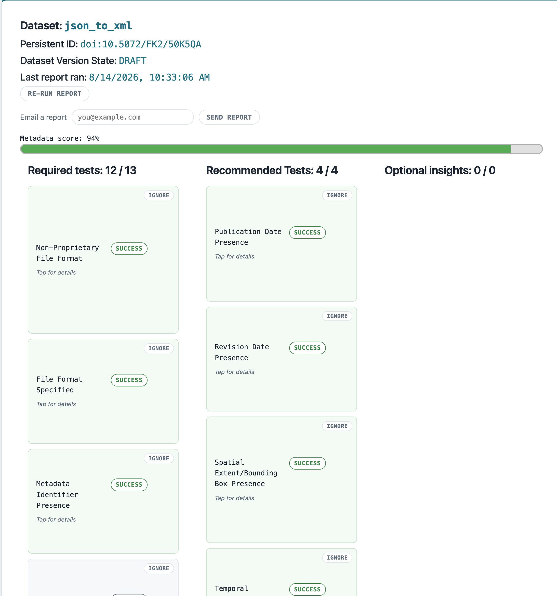

## Metadata Validation Tool
Joshua Gray

### Summary

This is a metadata validation tool for the Dataverse academic repository system, and provides infrastructure for using the [metadig-py](https://github.com/UCSB-Library-Research-Data-Services/metadig-py/tree/metadata-checker-install) metadata validation tool on the metadata for a given Dataset. Currently, the tool runs a suite of checks corresponding to FAIR data principles.

The application provides a web GUI for running and viewing the metadig reports, which is accessed in the form of an external tool in Dataverse.

### Architecture

- **`backend/`**: a FastAPI app (`backend/src/main.py`) that Dataverse launches as an "external tool", registered via `backend/manifest.json` and shown under a dataset's **Access** and **Edit** menus. Routes:
  - `GET /metadata-report`: the landing page Dataverse opens. It receives a base64-encoded `callback` query param from Dataverse, decodes it to fetch the dataset's metadata via Dataverse's signed-URL mechanism (`backend/src/utils/helpers.py`), and renders either `empty_dashboard.html` (no cached report yet) or `main_dashboard.html` (a cached report exists), backed by a sqlite cache (`backend/src/utils/db.py`, `backend/data/reports.db`). The frontend templates are rendered server-side using jinja2.
  - `POST /api/load-new-report`: re-fetches metadata for a dataset and re-runs the validator, caching the new report in the database.
  - `POST /api/toggle-check-visibility`: toggles whether a given check is shown on the dashboard at the discretion of the user.
  - `POST /api/send-report-email`: emails a cached report to a user-supplied address 

- **`backend/src/validator/`** : a local package that turns a dataset's metadata into a FAIR validation report
  - `run_metadata_report(metadata)`: translates the metadata into DataCite XML via the external [`dataverse-datacite-translator`](https://github.com/UCSB-Library-Research-Data-Services/dataverse-datacite-translator/tree/main) package, then hands it to `run_metadig_engine()`.
  - `run_metadig_engine()`: runs the [`metadig-py`](https://github.com/UCSB-Library-Research-Data-Services/metadig-py/tree/metadata-checker-install) engine (installed via git) against the FAIR suite and check definitions in `backend/src/validator/dataverse_checks/` (or the paths set via `METADIG_SUITE_PATH`/`METADIG_CHECKS_PATH` in `.env`).
  - `get_check_levels()`: parses the suite XML's `<check><level>` tags into a `{check_id: level}` map, used to sort results into the dashboard's Required/Recommended/Informational columns.

### Project Layout

```
.
├── backend/                     # FastAPI web GUI (Dataverse external tool)
│   ├── data/                    # sqlite cache (reports.db, gitignored) + sysmeta_dummy.xml
│   ├── tmp/                     # scratch dir for intermediate XML output (contents gitignored)
│   ├── manifest.json            # Dataverse external tool registration
│   └── src/
│       ├── main.py              # FastAPI app + routes
│       ├── constants.py         # check name/description lookups used to render the dashboard
│       ├── static/              # report.js, styles.css served at /static
│       ├── templates/           # Jinja2 templates (empty_dashboard.html, main_dashboard.html, email_report.html)
│       ├── utils/               # db.py (sqlite), helpers.py (Dataverse signed-URL client), templates.py (rendering), mailer.py (SMTP)
│       └── validator/
│           ├── main.py              # run_metadata_report(), run_metadig_engine(), get_check_levels()
│           └── dataverse_checks/    # bundled suite + check definitions (default paths; overridable via .env)
│               ├── dataverse-FAIR-suite.xml
│               └── checks/          # individual metadig check XML definitions
│
├── .env.example                 # template for required environment variables
├── requirements.txt             # Python dependencies (see Setup)
└── README.md
```

### Pipeline

When the user runs a report the following events occur

1) Metadata is retrieved via a Dataverse-signed callback URL.
2) The dataset JSON is translated into DataCite XML by the external [`dataverse-datacite-translator`](https://github.com/UCSB-Library-Research-Data-Services/dataverse-datacite-translator/tree/main) package.
3) The DataCite XML is validated by the metadig-py engine against the FAIR suite and check definitions in `backend/src/validator/dataverse_checks/` (or the paths set via `METADIG_SUITE_PATH`/`METADIG_CHECKS_PATH`).
4) Results are cached in sqlite and rendered on the dashboard.

### Prerequisites

- Python >= 3.12
- A Dataverse instance registered to launch this app as an external tool

### Setup

First, it is recommended that the project be installed in a virtual environment.
```bash

python3 -m venv .venv
source .venv/bin/activate

```

Then, install the packages with

```
./setup_metadig.sh
pip install -r requirements.txt
```

Copy `.env.example` to `.env` and fill it in with your specific data.

This tool is designed to use the `metadig-py` engine, in particular the fork at https://github.com/UCSB-Library-Research-Data-Services/metadig-py/tree/metadata-checker-install. Thus, while the tool comes pre-configured with selected XML tests and suites, the user is able to modify tests being run to satisfy their specific needs.

In order to do this, simply modify the `METADIG_SUITE_PATH`/`METADIG_CHECKS_PATH` variables in your `.env`. Without these variables set, the tool defaults to the bundled XML tests, which work well with the Datacite export and have been slightly customized.

The user is responsible for selecting/writing XML tests that work correctly with the Datacite XML export.

### Running the web GUI (Dataverse external tool)

Start the backend:

```
cd backend/src
fastapi dev
```

This serves on `http://127.0.0.1:8000`, matching the `toolUrl` in `backend/manifest.json`. Register `backend/manifest.json` with your Dataverse instance as an external tool (via Dataverse's [external tools admin API](https://guides.dataverse.org/en/6.11/admin/external-tools.html)) so it appears under a dataset's **Access** and **Edit** menus.

To run the external tool at a different endpoint, the `manifest.json` must be edited and registered in dataverse.

To use it: open a Dataset in Dataverse, click **Access Dataset** or **Edit**, and select **metadata-checker**. The dashboard shows the dataset's title, PID, and version state; a pass/fail percentage with a progress bar; and checks grouped into Required, Recommended, and Informational columns based on the `<level>` encoded in the suite XML. Each check is a click-to-flip card showing its description and output, with a visibility toggle to hide/show it from the summary. A "Re-run report" button re-fetches metadata and re-runs the validation suite, and a "Send me a report" button emails the cached report to an address you supply.




### Credit and Attributions

This tool was written by [Joshua Gray](https://www.linkedin.com/in/joshuaegray/) for UCSB Library and Research Data Services.

### Disclaimer

This code is provided "as is," with no warranties or guarantees of any kind. It was developed primarily for internal use; neither UCSB nor Joshua Gray is responsible for any damages resulting from its use.
